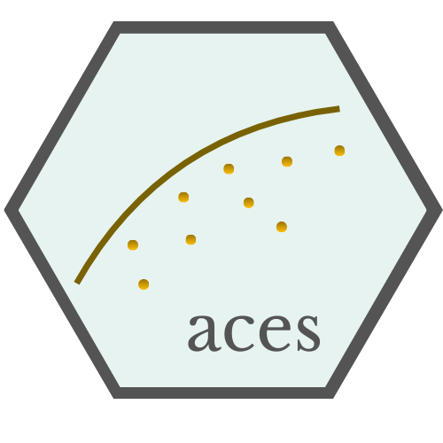

<table style="border:0;width:100%;border-collapse:collapse;margin:0;">
  <tr>
    <td style="width:200px;vertical-align:middle;padding:0;border:0;">
      
    </td>
    <td style="vertical-align:middle;padding:0 0 0 10px;border:0;">
      <h1 style="margin:0;font-weight:700;font-size:3.4rem;line-height:1;color:#4b5563;">
        Adaptive Constrained Enveloping Splines
      </h1>
    </td>
  </tr>
</table>
<hr style="margin:8px 0;border:0;border-top:1px solid #e5e7eb;">

# Overview

`aces` presents a unified family of techniques for estimating production frontiers, designed to address key limitations of traditional DEA, such as overfitting, limited robustness, and challenges in high-dimensional settings. This family includes three complementary methods: Adaptive Constrained Enveloping Splines (ACES), which offers a flexible estimator of technical efficiency; Random Forest-ACES (RF-ACES), which enhances robustness through ensemble learning; and Quick-ACES (Q-ACES), which focuses on computational efficiency for large-scale applications. Each method addresses different empirical needs, enabling researchers to select the most appropriate approach based on the characteristics of the data.

# Installation

```r
# From CRAN
install.packages("aces")

# Or the devlopment version from Github:
# install.packages("devtools")
devtools::install_github("Victor-Espana/aces")
``` 

## Example

This is a basic example of how to fit an Adaptive Constrained Enveloping Splines (ACES) model.

``` r
library("aces")

# simulate data with two inputs and two outputs
data <- aces:::translog_X2Y2 (
  N = 100,
  border = 0.10,
  noise = FALSE
)

# estimate an Adaptive Constrained Enveloping Splines model
aces_model <- aces (
  data = data,
  x = 1:2,
  y = 3:4,
  mul_BF = list (
    "max_degree" = 2,
    "inter_cost" = 0.05
  )
)

# predict maximum output
y_hat <- predict (
  object = aces_model,
  newdata = data,
  x = 1:2,
  method = "aces"
)

# compute efficiency scores
rad_out_scores <- aces_scores (
  eval_data = data,
  x = 1:2,
  y = 3:4,
  object = aces_model,
  method = "aces",
  measure = "rad_out"
)
```

This is a basic example of how to fit a Random Forest–Adaptive Constrained Enveloping Splines (RF-ACES) model. Please note that training can be computationally intensive and may take a long time to run.

``` r
library("aces")

# simulate data with three inputs and one output
data <- aces:::cobb_douglas_XnY1 (
  N = 50,
  nX = 3
)

# estimate a Random-Forest Adaptive Constrained Enveloping Splines model
rf_aces_model <- rf_aces (
  data = data,
  x = 1:3,
  y = 4,
  mul_BF = list (
    "max_degree" = 2,
    "inter_cost" = 0.05
  ),
  learners = 50
)

# predict maximum output
y_hat <- predict (
  object = rf_aces_model,
  newdata = data,
  x = 1:3,
  method = "rf_aces"
)

# compute efficiency scores
rad_out_scores <- rf_aces_scores (
  eval_data = data,
  x = 1:3,
  y = 4,
  object = rf_aces_model,
  method = "rf_aces",
  measure = "rad_out"
)
```

This is a basic example of how to fit a Quick Adaptive Constrained Enveloping Splines (Q-ACES) model. This variant is designed to accelerate the estimation process by reducing the number of candidate basis functions, making it considerably faster than the standard ACES approach while maintaining reliable results.

``` r
library("aces")

# simulate data with five inputs and one output
data <- aces:::cobb_douglas_XnY1(
  N = 50,
  nX = 5
)

# estimate an Adaptive Constrained Enveloping Splines model
q_aces_model <- aces (
  data = data,
  x = 1:3,
  y = 4,
  quick_aces = TRUE,
  mul_BF = list (
    "max_degree" = 3,
    "inter_cost" = 0.05
  )
)

# predict maximum output
y_hat <- predict (
  object = q_aces_model,
  newdata = data,
  x = 1:3,
  method = "aces"
)

# compute efficiency scores
rad_out_scores <- aces_scores (
  eval_data = data,
  x = 1:3,
  y = 4,
  object = q_aces_model,
  method = "aces",
  measure = "rad_out"
)
```

## Citing

Please cite the following articles:

- España, V. J., Aparicio, J., Barber, X., & Esteve, M. (2024). *Estimating production functions through additive models based on regression splines*. European Journal of Operational Research, 312(2), 684–699.

- España, V. J., Aparicio, J., & Barber, X. (2025). *Estimating production technologies using multi-output adaptive constrained enveloping splines*. Computers & Operations Research, 107242.

- España, V. J., Aparicio, J., & Barber, X. (2025). *An adaptation of Random Forest to estimate convex non-parametric production technologies: an empirical illustration of efficiency measurement in education*. International Transactions in Operational Research, 32(5), 2523–2546.

